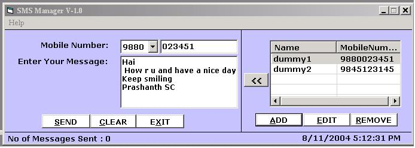



## Send SMS For Free\.\.without any registration

### Description

U can Send SMS without any registration to any of the provider.SMS-Sender is provided with contacts options where u can store ur friends name and Number which u can use at the time of running.Very Easy of Sending sms ..just select the number and type in the message and Clicking Send..Button done.It uses MSWINSCK and msmapi ocx..which is usally found in windows/system folder.If throws any error u can find these ocx availble on many sites.(address.txt file shud be used)..Any Suggestions and healthy criticism is always welcome..
 
### More Info
 

             |
---                |---
**Submitted On**   |2004-08-11 10:08:40
**By**             |[Prashanth SC](https://github.com/Planet-Source-Code/PSCIndex/blob/master/ByAuthor/prashanth-sc.md)
**Level**          |Intermediate
**User Rating**    |3.3 (40 globes from 12 users)
**Compatibility**  |VB 6\.0
**Category**       |[Complete Applications](https://github.com/Planet-Source-Code/PSCIndex/blob/master/ByCategory/complete-applications__1-27.md)
**World**          |[Visual Basic](https://github.com/Planet-Source-Code/PSCIndex/blob/master/ByWorld/visual-basic.md)
**Archive File**   |[Send\_SMS\_F1780738112004\.zip](https://github.com/Planet-Source-Code/prashanth-sc-send-sms-for-free-without-any-registration__1-55504/archive/master.zip)

